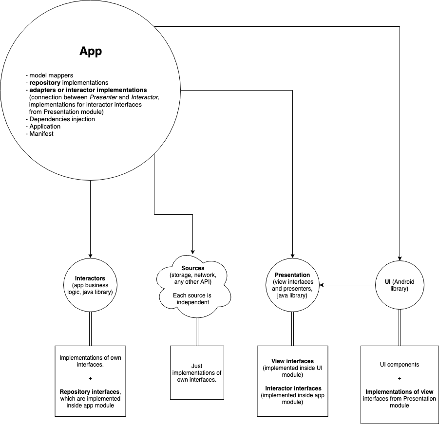

# Android microservice architecture
### A simple Twitter client with implementation of microservice architecture for Android OS.

##### !!!Attention!!! 
You should put your own Twitter key and secret to the `local.properties`
file.

For example:

`twitter_key="your_key"`

`twitter_secret="your_secret"`

All tests are in separate module, except presenters tests. They are
located in the `app` module, because of *Moxy* library implementation.

In the project, you can see how to make all modules maximum independent
from any other modules. For example, modules with Interactors, 
Presenters, and sources (Twitter API and Storage) have no dependencies
on any modules of the project. So, they could be moved to the separate
git repository and develop by a separate team (of course, if it's
needed).

The `app` module is something like a proxy for all the modules.
Repository, Adapters, Application, and Dagger (DI) are located in this
module. So, through the DI we allowed injecting our implementations to
each module which need them. For this used AndroidInjection.

The dependencies between modules described in the diagram below. There
we can see `Sources`, in the project we have two: `twitter` and
`storage`.

